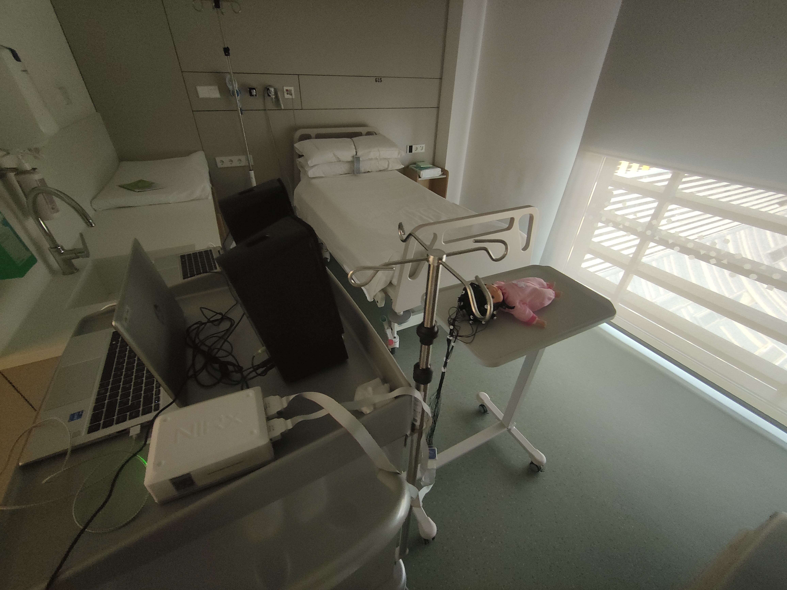
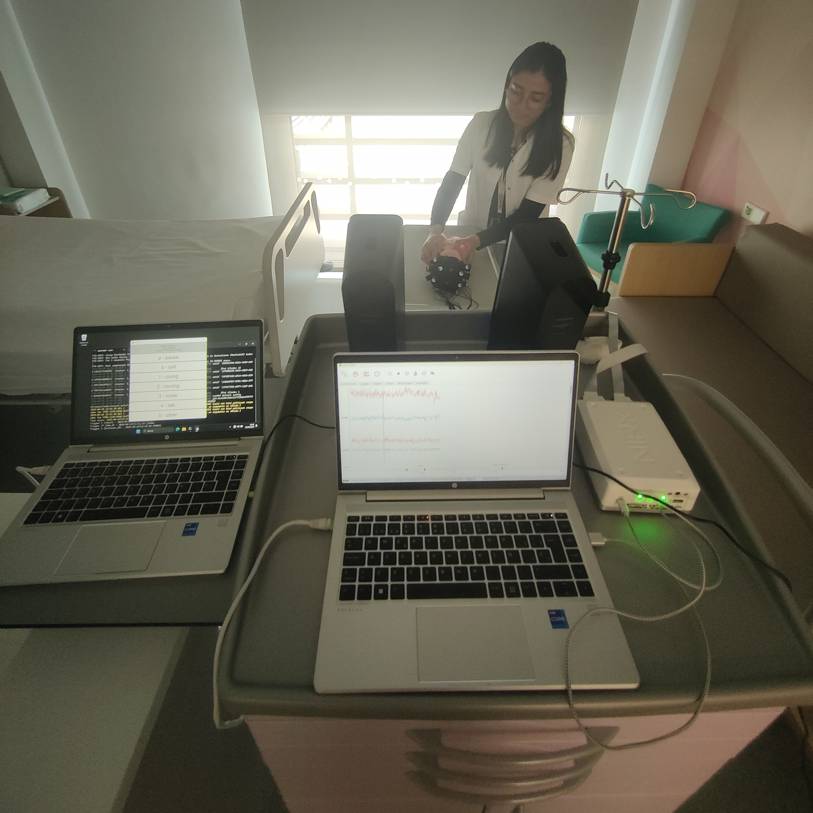

::: {.cell}

:::


## Continuous speech, discrete units


::: {.notes}
- We are focusing on one of the first and most critical steps in language acquisition: chunking the continuous speech stream into discrete, linguistically relevant units.
:::

## The syllable: a privileged linguistic unit?

Newborns (and adults) preferentially chunk the speech signal into [syllable-sized units]{style="background-color: #e3e1e1;"} [e.g., @bijeljac19934; @flo2022sleeping; @luo2007phase; @jusczyk1987representation; @bertoncini1988investigation]

Pre-term infants (28-32 gestational weeks) discriminate different syllables [@mahmoudzadeh2013syllabic]


::: {.notes}
- Syllables seem to be specially important during the first stages of language acquisition
- Newborns preferentially parse speech into syllables (as opposed to individual phonemes, words, or phrases)
- What makes syllables so special? 
:::


## Syllabic structure


|Structure |Onset  |Nucleus  |Coda  |
|----------|:-----:|:-------:|:----:|
| V        |       |a        |      |
| CV       | t     |a        |      |
| CVC      | t     |a        |n     |
| VC       |       |a        |n     |


::: {.notes}
- Same examples of syllables
:::


## Language-specific constraints to syllabic structure

| Structure | Japanese     | Spanish          | English         |
|-----------|--------------|------------------|-----------------|
|V          | [u]{style="background-color: #e3e1e1;"}.mi     | [o]{style="background-color: #e3e1e1;"}.jo         | [a]{style="background-color: #e3e1e1;"}.ny        |
|CV         | [ya]{style="background-color: #e3e1e1;"}.ma.ha | [ca]{style="background-color: #e3e1e1;"}.sa        | [fai]{style="background-color: #e3e1e1;"}.ry      | 
|CVC        | [hon]{style="background-color: #e3e1e1;"}.da   | [rin]{style="background-color: #e3e1e1;"}.cón      | [con]{style="background-color: #e3e1e1;"}.trol    |
|CCVC       |              | [fres]{style="background-color: #e3e1e1;"}.co      | [fresh]{style="background-color: #e3e1e1;"}       |
|CCVCC      |              | [trans]{style="background-color: #e3e1e1;"}.por.te | [shrink]{style="background-color: #e3e1e1;"}     |
|CCCVCCC    |              |                  | [strengths]{style="background-color: #e3e1e1;"}   |


::: {.notes}
- Not all syllabic structures are possible in all languages
- Some languages impose stricter phonotactical constraints on the specific sounds and number of sounds that can occur at onset or coda
:::


## Maximal Onset Principle (MOP)

Linguistic universal
: Consonants are preferably grouped at syllabic onset

<br>

* MOP following ([MOP+]{style="background-color: #5778a4; color: white"}): CV.CCV - /mo.pla/
* MOP violating ([MOP-]{style="background-color: #e49444; color: white"}): CVC.CV - /mop.la/

::: box
Is MOP a mechanism for detecting syllables at birth?
:::

::: {.notes}
- However, some constraints to syllabic structure seem to be universal
- Universal: most, if not all languages, show a preference for following some specific constraints
- The aim of this project is to investigate the possible role of these universals as an early mechanism for syllabification
:::


## The present study

Functional near-infrared light spoctroscopy (**fNIRS**):

- Relative changes in concentration of oxy-hemoglobin ($\Delta$HbO) and deoxy-hemoglobin ($\Delta$HbR) across time (haemodynamic response)
- Indirect measure of neural activity, mostly in the cortex


## The present study

::: box
**Hypothesis 1**
: If newborns are sensitive to violations of the MOP, the haemodynamic responses to MOP+ and MOP- words should differ.
:::

<br>

::: center
[mo.pla]{style="background-color: #5778a4; color: white"} $\neq$ [mop.la]{style="background-color: #e49444; color: white"}
:::


## Are newborns sensitive to (violations of) the MOP?

::: box
**Hypothesis 2**
: If newborns have an innate preference for MOP+ structures, the haemodynamic response to MOP+ words should be *greater* than for MOP- words.
:::

<br>

::: center
[mo.pla]{style="background-color: #5778a4; color: white"} $\gt$ [mop.la]{style="background-color: #e49444; color: white"}
:::


## Are newborns sensitive to (violations of) the MOP?

Newborns sometimes rely exclusively on 1st syllables [@flo2022sleeping]

::: box
**Hypothesis 3**
: If newborns discriminate between MOP+ and MOP- (Hypothesis 1), they do so by processing the disyllabic structure of the word (not just the first syllable).
:::

<br>

::: center
[mop.pla]{style="background-color: #e49444; color: white"} $\neq$ [mop]{style="background-color: #6a9f58; color: white"}
:::


## Stimuli

**CVCCV words**: Onset + Vowel + Consonant cluster (CC) + Vowel

| **List** | **Condition** | **Structure** | **Words** |
|----------|---------------|---------------------|-----------|
| 1   | [Standard (ST)]{style="background-color: #5778a4; color: white"} | CV-CCV              | MO-PLA, SA-KLO, TI-PLE, DE-KLI | 
|          | [Deviant word (DW)]{style="background-color: #e49444; color: white"}  | CVC-CV              | MOP-LA, SAK-LO, TIP-LE, DEK-LI | 
|          | [Deviant syllable (DS)]{style="background-color: #6a9f58; color: white"} | CVC                 | MOP, SAK, TIP, DEK             |
| 2   | [Standard (ST)]{style="background-color: #5778a4; color: white"}         | CV-CCV              | MO-KLA, SA-PLO, TI-KLE, DE-PLI |
|          | [Deviant word (DW)]{style="background-color: #e49444; color: white"}     | CVC-CV              | MOK-LA, SAP-LO, TIK-LE, DEP-LI |
|          | [Deviant syllable (DS)]{style="background-color: #6a9f58; color: white"} | CVC                 | MOK, SAP, TIK, DEP             |
: {tbl-colwidths="[5,31, 14, 50]"}

## Stimuli

* Synthesised using MBROLA  (`it4` voice) (*pymbrola* Python package)
* 25 ms pause between syllables
* Constant prosody: 200 Hz F0
* Manually removed offset voicing from CVC syllables (Praat)

## Block design

Bigger effect sizes [e.g., @abboub2016prosodic; @mahmoudzadeh2013syllabic].

Inspired by Mahmoudzadeh et al. (2013): block *oddball* paradigm.

::: box
Blocks > Trials > Words
:::

## Block design

### Standard (ST) block


## Block design

### Deviant word (DW) block


## Block design

### Deviant syllable (DS) block


## Block design


::: columns
:::: column


::: {.cell}
::: {.cell-output-display}

```{=html}
<audio controls="">
<source src="sounds/st-block.wav" type="audio/wav"/>
</audio>
```

:::
:::


::::
:::: column


::: {.cell}
::: {.cell-output-display}

```{=html}
<audio controls="">
<source src="sounds/dw-block.wav" type="audio/wav"/>
</audio>
```

:::
:::


::::
:::: column


::: {.cell}
::: {.cell-output-display}

```{=html}
<audio controls="">
<source src="sounds/ds-block.wav" type="audio/wav"/>
</audio>
```

:::
:::


::::
:::

## Participants


::: {.cell}

:::


* Healthy, full term neonates.^[Last Apgar score $\geq$ 9, $\geq$ 37 gestation weeks, $\geq$ 2,700g birth weight.]
* Born at the Àrea de la Dona from Hospital Sant Joan de Déu (Barcelona), tested in their room.


::: {.cell}
::: {.cell-output-display}
{#fig-participants width=5600}
:::
:::


::: {.notes}
- We will run an experimental series that involves neonates and infants
- Neonates will be tested using fNIRS, while infants will be tested using fNIRS and behavioural tasks (like the HeadTurn Preference Procedure)
- I will focus on the fNIRS testing of neonates and infants, as they follow the same task design
- Ideally, we'd like to test up to 50 participants per experiment, although power analysis is pending
- Most of our participants will have a Catalan and/or Spanish background
:::

## Procedure:

* Baby in the crib:
  - Capping between 2 people
  - Hands-on monitoring of the newborn and placement of the cap.
* Baby in parents' arms:
  - Capping by 1 or 2 people.
  - Not ideal: capping is more challenging.
* Calibration, then testing

## Procedure





## Procedure

::: {layout="[[1,2], [1]]"}





:::

## Procedure

### Attrition

* Neonate gets botherd by the cap
* Neonate is too awake
* Neonate cries too much (fussiness)
* Bad caping due to neonate’s position
* Parental interference
* Background noise


## Participants


::: {.cell}

:::


* **Pilot** (2025-02-05--2025-03-06): 13: Participants.
* **Experiment** (2025-02-05--now): 50.
    - Excluded (< 10 min.): 18 crying, 3 bad capping.
    - Provided valid data: 31
    - Data quality ranges a lot between participants


## Montage

::: {layout-nrow=2}


:::


## Data analysis

MNE-NIRS (Python):

1) Light intensity to **optical density**
2) Automatic **channel rejection** based (SCI $\geq$ .80)
3) **Motion arctifact correction** (TDDR)
4) Calculate **$\Delta$HbO and $\Delta$HbO** using the modified Beer-Lambert Law
5) Band-pass **filter** (0.01-1.0 Hz)
6) **Block epoching** (-5 to 30 seconds), baseline correction, linear detrend
7) **Block averaging**
8) **Participant rejection** ($\geq$ 2 trials per condition)

# Results

Haemodynamic response averaged across blocks, channels, and participants.

[HbO]{style="background-color: #d1615d; color: white"} [HbR]{style="background-color: #5778a4; color: white"}


# Results

Haemodynamic response averaged across blocks, channels, and participants.

[ST]{style="background-color: #5778a4; color: white"} [DW]{style="background-color: #e49444; color: white"} [DS]{style="background-color: #6a9f58; color: white"}


# Results

Haemodynamic response averaged across blocks and participants.


# Results

Haemodynamic response averaged across blocks and participants.


# Discussion

So far:

* Testing protocol done
* fNIRS setup up and running
* Data processing pipeline almost ready

# Discussion

Next steps:

* Finish data collection: 30-40 participants.
* Statistical modelling:
  - Time-domain analysis: Cluster-based permutation testing
  - Waveform analysis: Bayesian GAMMs
  - Summary statistics: Peak amplitude, AUC, time-to-peak

## {background-image="img/thanks.png"}

# Appendix

## NIRS setup

* NIRSport2 (NIRx), CW 760 nm & 850 nm
* Sampling frequency 20.345 Hz (~0.05 s samples)
* NIRScap: 8 channels LH, 8 channels RH

## References


